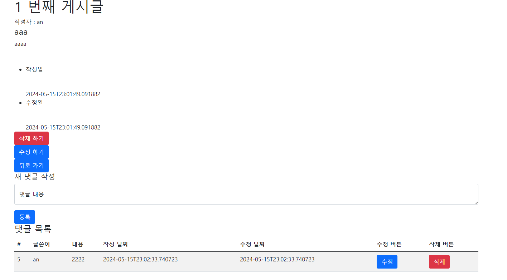

## 게시판 프로젝트

### 실행
#### 스크린샷
| 홈 |                     게시물                      |
|:--:|:--:|
||  |

| 게시물 보기 |                                 사용자 정보                                 | 
|:------:|:----------------------------------------------------------------------:|
|   |  |

#### 동영상

### 목표
- [x] 타임리프와 자바 스프링 부트 이용해 게시판 프로젝트 만들어 Azure에 CICD로 배포하기기
- [x] 1차 : H2 인메모리 DB를 이용해 게시글 CRUD 하기
- [x] 2차 : mysql로 변경(local) > 클라우드에 올리면서 잠시 다시 H2로 변경
- [x] 3차 : 댓글 기능 추가 > 댓글 삭제 정책 등을 고려하게 됨.
- [x] 4차 : spring security로 로그인 기능
- [x] 5차 : 로그인 한 사용자 본인의 게시글에만 수정, 삭제를 할 수 있게 함 등 + session 처리
- [x] 6차 : 사용자 정보 수정(이름, 이미지) 등 작성 > 이미지에 대해 처리하면서 file Storage를 생각하게 됨
- [x] 7차, 8차 : CICD로 cloud 로 자동 배포되게 변경 > H2로 임시로 변경 (이미지 저장도 DB에 Lob으로)
- [x] 9차 : Password warning 문제로 회원 가입시 최소한의 비밀번호 복잡도 요구
- [X] 10차 : H2 에서 Azure MySQL DB를 사용하게 변경 (이 부분을 사용할 때는 SQL 문을 바꿔줘야 함!)
- [X] 11차 : DB에는 image의 경로를 넣고 Blob Storage에 이미지 저장

### 기능 구현 목록
- [기능 구현 목록](docs/Feature-Implementation-List.md)

## Local 환경에서 테스트 수행하기
> dev 환경에서는 H2 인메모리 데이터베이스를 사용하고, ddl-auto가 update입니다.
> 따라서 별도의 데이터베이스와 테이블을 준비할 필요 없습니다.

#### Azurite 준비하기

  
 NPM이 설치되지 않은 경우

  <ol>
    <li> nvm 설치</li>
      <ul>
        <li>[nvm-windows](https://github.com/coreybutler/nvm-windows/releases)에서 Assets의 `nvm-setup.exe`를 다운받는다.</li>
        <li>다운로드한 파일을 실행시켜 라이센스 동의 후, 기본 작성된 설정값들을 유지해서 설치한다.</li>
        <li>설치가 잘 되었는지 확인하기 위해 cmd에서 `nvm -v` 명령어로 현재 버전을 확인한다.</li>
        <li>24년 5월 15일 기준 : `1.1.12` 버전이라 나온다.</li>
      </ul>
    <li> Node.js 설치 (npm 같이 설치됨)</li>
      <ul>
        <li>cmd에서 `nvm list available`을 입력해 이용가능한 Node.js 버전 목록 확인</li>
        <li>24.5.15 기준 가장 최신 LTS 버전인 `20.13.1`을 `nvm install 20.13.1` 명령어로 설치한다.</li>
        <li>`nvm list` 명령어로 설치되어 있는 nvm 버전 목록을 확인한다.</li>
        <li>`nvm use 20.13.1` 명령어로 이 버전을 사용하도록 한다. `nvm list` 명령어로 Node 설치된 목록 리스트 중 사용하는 버전을 확인한다.</li>
        <li>`node -v` 명령어로 현재 node.js 버전을 확인하고, `npm -v` 로 npm의 현재 버전을 확인한다.</li>
      </ul>
  </ol>

- npm이 설치된 경우 [Use Azurite emulator for local](https://learn.microsoft.com/en-us/azure/storage/common/storage-use-azurite?tabs=npm%2Cblob-storage)를 따라서 azurite를 npm으로 설치한다.
- cmd에 `npm install -g azurite` 명령어로 Azurite를 install 한다.
- [Azure Storage Explorer](https://azure.microsoft.com/en-us/products/storage/storage-explorer/)를 설치한다.
- Azure Storage Explorer에 들어가 [탐색기 > 에뮬레이터 및 연결된 항목 > 스토리지 계정 > 에뮬레이터-기본포트 > Blob Containers]에서 BlobContainers에서 마우스 우클릭으로 "test"라는 이름의 컨테이너를 생성한다.
- 로컬에서 프로젝트를 실행하고자 할 때, azurite를 run 해야한다.
  - `azurite --silent --location c:\azurite --debug c:\azurite\debug.log` 명령어로 azurite를 실행한다.
  - 위 명령어에서 `--location` 옵션이 없으면 현재 워킹 디렉토리를 사용한다.

#### 실행하기
- cmd에서 azurite를 실행하지 않았다면, azurite를 run하는 명령어로 실행한다.
- ide를 이용해 JavaBoardApplication을 run 한다.
- 브라우저에서 http://localhost:80으로 들어가 수행한다.

## Azure Cloud 환경에서 수행하기
> Web App, DataBase, Blob Stroage, CDN을 사용합니다.

#### Azure Portal에서
리소스 그룹명, 데이터베이스명, 웹앱 명은 전부 변경해도 됩니다. 환경 변수 이름은 변경하면 안됩니다!
1. Azure에서 리소스 그룹 `java-board`로 생성한다. 
2. 리소스 그룹에 Web App추가 `java-board-webapp` 생성 - F1 요금제 이용
   - 환경변수 추가 : `SPRING_PROFILES_ACTIVE`의 값을 `prod`로 추가한다.
   - Repository secrets를 추가한다.
     - `AZURE_WEBAPP_PUBLISH_PROFILE` : `그 값`
     - `그 값`은 web app의 overview에서 download publish profile을 통해서 얻을 수 있다.
3. 리소스 그룹에 Azure Database for MySQL Flexible Server를 추가한다. `java-board-database` 생성한다. - 요금제 가장 저렴한 것 이용.
   - 이때 관리자 이름과 비밀번호를 기억한다. 
4. 데이터베이스 연결을 위해 [MySQL Workbench](https://dev.mysql.com/downloads/workbench/)를 로컬에 설치한다.
   - workbench에서 새로운 연결을 위해 새 연결을 추가한다.
   - 연결 이름 필드에 연결 이름을 입력한다. (`java-board`로 설정함)
   - hostname 필드에 Azure Database for MySQL에 있는 '서버 이름'을 추가한다.
   - 사용자 이름과 비밀번호에 azure database 추가할 때 작성한 것을 연결한다.
   - 테스트 커넥션 버튼을 클릭해서 성공하면 OK를 누른다.
      

        
아래의 데이터베이스 문으로 테이블을 생성한다. 

    
          CREATE DATABASE board;
          USE board;
          
          CREATE TABLE article(
          id BIGINT AUTO_INCREMENT PRIMARY KEY,
          title VARCHAR(255),
          content TEXT,
          writer VARCHAR(255),
          created_at DATETIME,
          updated_at DATETIME
          );
          
          CREATE TABLE comment(
          id BIGINT AUTO_INCREMENT PRIMARY KEY,
          writer VARCHAR(255),
          content TEXT,
          created_at DATETIME,
          updated_at DATETIME,
          article_id BIGINT,
          FOREIGN KEY (article_id) REFERENCES Article(id)
          );
          
          CREATE TABLE app_user (
          id BIGINT AUTO_INCREMENT PRIMARY KEY,
          email VARCHAR(45) UNIQUE NOT NULL,
          password VARCHAR(255),
          name VARCHAR(255),
          nickname VARCHAR(255),
          profile_image_url VARCHAR(255)
          );
          
          ALTER DATABASE board SET TIMEZONE = 'Korea Standard Time';
    
      

5. Azure Portal에서 `java-board-webapp`에서 데이터베이스 관련 환경 변수를 등록한다. 
   - 요금 문제로 인해 환경 변수를 사용했지만, key-vault 를 사용하는 것이 권장된다. (초반에 사용했다가 변경)
   - 이름 : 값으로 표현한다.
   - `DATASOURCE_URL` : `jdbc:mysql:://<데이터베이스호스트명>:3306/board` 
   - `DATASOURCE_USERNAME` : `데이터베이스 사용자 명`
   - `DATASOURCE_PASSWORD` : `비밀번호` 
6. 스토리지 계정이 없다면 추가한다. 스토리지 계정에 들어가서 [데이터 스토리지 > 컨테이너] 에서 `사용할 컨테이너명`으로 컨테이너를 추가한다.
7. `java-board-webapp`에서 Blob Stroage 환경 변수를 등록한다.
   - `BLOB_STORAGE_CONTAINER_NAME` : `사용할 컨테이너명`
   - `BLOB_STORAGE_CONNECTION_STRING` : `연결 문자열`
     - 스토리지계정에서 [보안+네트워킹 > 액세스 키]의 연결 문자열을 복사
8. cdn 적용
   - blob storage에서 [보안+네트워킹 > Front Door 및CDN ]으로 가 Azure Front Door 서비스 유형으로 CDN을 만든다.
   - `java-board-webapp`에서 `BLOB_STORAGE_CONNECTION_STRING` 환경 변수를 변경한다.
     - `BLOB_STORAGE_CONNECTION_STRING` : `DefaultEndpointsProtocol=https;AccountName=<계정이름>;AccountKey=<키>;BlobEndpoint=<cdn엔드포인트>`
9. md 파일의 띄어쓰기 등을 약간 수정하고, tag로 `v*.*.*` 패턴을 붙여서 push하면 CICD로 자동 배포가 완료됩니다.
